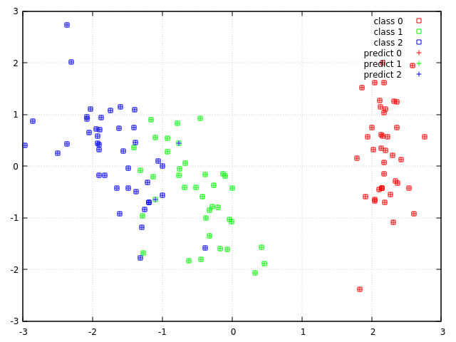

## Classification with Shark-ML machine learning library

[Shark-ML](http://www.shark-ml.org/) is an open-source machine learning library, it's site tells next: "_It provides methods for linear and nonlinear optimization, kernel-based learning algorithms, neural networks, and various other machine learning techniques. It serves as a powerful toolbox for real world applications as well as for research. Shark works on Windows, MacOS X, and Linux. It comes with extensive documentation. Shark is licensed under the GNU Lesser General Public License._" I can confirm that it offers a wide range of machine learning algorithms together with nice documentation, tutorials and samples. So in this article I will show the basic API concepts, details can be easily found in official [documentation](http://www.shark-ml.org/sphinx_pages/build/html/rest_sources/tutorials/tutorials.html). 

In this article I will show how to use this library for solving a classification problem. I've used [Iris](https://www.kaggle.com/uciml/iris) dataset in this example, so loading data will depend on on it's format.

0. **Library installation**

    Library should be compiled from sources, build scripts can be generated with CMake. Details about available CMake options can be found in [documentation](http://www.shark-ml.org/sphinx_pages/build/html/rest_sources/installation.html). Also you should have installed [Boost](https://www.boost.org/), because library depends from it. I did not find any problems with compilation. Also I used ``CMAKE_INSTALL_PREFIX`` option to changes default installation path, it allows to clear library artifacts after experiments.  

2. **Loading data**
    
    In this sample I'm going to download a dataset from internet. There is function ``shark::download`` in the library, but the problem is that it doesn't support ``https`` protocol. So I used function I wrote using  ``curl`` library:
    ```cpp
    static const std::string train_data_url =
    "https://raw.githubusercontent.com/pandas-dev/pandas/master/pandas/tests/data/iris.csv";
    ...
    const std::string data_path{"iris.csv"};
    if (!fs::exists(data_path)) {
        if (!utils::DownloadFile(train_data_url, data_path)) {
          std::cerr << "Unable to download the file " << train_data_url
                    << std::endl;
          return 1;
        }
    }
    ```
    After file is downloaded you can use ``shark::csvStringToData`` do load data in ``shark::ClassificationDataset`` type object. But before do it you have to prepare this concrete dataset - remove row with columns names and replace labels string names with numbers:
    
     ```cpp
    std::ifstream data_file(data_path);
    std::string train_data_str((std::istreambuf_iterator<char>(data_file)),
                             std::istreambuf_iterator<char>());
    
    // ----------- Remove first line - columns labels
    train_data_str.erase(0, train_data_str.find_first_of("\n") + 1);
    
    // ----------- Replace string labels with integers
    train_data_str =
      std::regex_replace(train_data_str, std::regex("Iris-setosa"), "0");
    train_data_str =
      std::regex_replace(train_data_str, std::regex("Iris-versicolor"), "1");
    train_data_str =
      std::regex_replace(train_data_str, std::regex("Iris-virginica"), "2");
    ```
    
    Now we are ready to create to create a dataset object, with ``shark::LAST_COLUMN`` parameter we tell function that last column is labels:
    
    ```cpp
    shark::ClassificationDataset train_data;
    shark::csvStringToData(train_data, train_data_str, shark::LA ST_COLUMN);
    ```

3. **Pre-processing data**
    
    Before training classifiers or using other ML algorithms usually it's a good idea to normalize and shuffle your training data. Shark-ML already have good [tutorial](http://www.shark-ml.org/sphinx_pages/build/html/rest_sources/tutorials/concepts/data/normalization.html) about normalization. At first I shuffled the data and cutoff the part for a test set:
    ```cpp
    train_data.shuffle();
    auto test_data = shark::splitAtElement(train_data, 120);
    ```
    Then I defined a normalizer object and trainer for him. It's a common approach in Shark-ML to separate type for algorithm and for his trainer:
    ```cpp
    bool remove_mean = true;
    shark::Normalizer<shark::RealVector> normalizer;
    shark::NormalizeComponentsUnitVariance<shark::RealVector>
        normalizing_trainer(remove_mean);
    normalizing_trainer.train(normalizer, train_data.inputs());
    ```
    After trainer learned mean and variance and configured normalizer, we can use it to transform our data:
    ```cpp
    train_data = shark::transformInputs(train_data, normalizer);
    ```
    But there are trainers without a ``train`` method, lets see a PCA dimension reduction example:
    ```cpp
    shark::PCA pca(data.inputs());
    shark::LinearModel<> enc;
    pca.encoder(enc, 2);
    shark::Data<shark::RealVector> encoded_data = enc(data.inputs());
    ```
    Here ``pca`` object took data for learning in constructor and configured model for a dimension reduction with ``encoder`` method. 

4. **SVM**
    
    In this sample I used cross-validation technique for training and grid search for obtaining optimal parameters for SVM classifier. My code is based on official samples for [SVM](http://www.shark-ml.org/sphinx_pages/build/html/rest_sources/tutorials/algorithms/svm.html) and [model selection](http://www.shark-ml.org/sphinx_pages/build/html/rest_sources/tutorials/algorithms/svmModelSelection.html). So first of all let divide our data in some number of folds: 
    
    ```cpp
    const unsigned int k = 5;  // number of folds
    shark::CVFolds<shark::ClassificationDataset> folds =
            shark::createCVSameSizeBalanced(train_data, k);
    ```
    
    Next I defined SVM trainer and classification model objects:
    ```cpp
    double c{1.0};
    double gamma{0.5};
    bool offset = true;
    bool unconstrained = true;
    
    // template parameter is input type
    auto svm = std::make_shared<SVMModel>(gamma, unconstrained);
    
    shark::CSvmTrainer<shark::RealVector> trainer(&svm->kernel, c, offset,
                                                unconstrained);
    trainer.setMcSvmType(shark::McSvm::OVA);  // one-versus-all
    ```
    Please pay attention to ``SVMModel`` type, I defined it because SVM model consist of kernel and classifier their life time should be the same during all time you are using classification model. When you pass pointer to kernel to trainer it doesn't take or pass ownership to classifier object.
    ```cpp
    struct SVMModel {
    SVMModel(double gamma, bool unconstrained) : kernel(gamma, unconstrained) {}
        shark::GaussianRbfKernel<> kernel;
        // template parameter is input type
        shark::KernelClassifier<shark::RealVector> model;
    };
    ``` 
    After that I had everything required for instantiation of cross validation error object:
    ```cpp
    shark::ZeroOneLoss<unsigned int> loss;
    shark::CrossValidationError<shark::KernelClassifier<shark::RealVector>,
                              unsigned int>
      cv_error(folds, &trainer, &svm->model, &trainer, &loss);
    ```
    And now we are ready to use grid search for parameters estimation. Lets define initial grid parameters:
    ```cpp
    // estimate initial gamma value
    shark::JaakkolaHeuristic ja(train_data);
    double ljg = log(ja.gamma());
    // we have two hyperparameters so define the grid accordingly
    shark::GridSearch grid;
    std::vector<double> min(2);
    std::vector<double> max(2);
    std::vector<size_t> sections(2);
    // kernel parameter gamma
    min[0] = ljg - 4.;
    max[0] = ljg + 4;
    sections[0] = 9; // number of values in the interval
    // regularization parameter C
    min[1] = 0.0;
    max[1] = 10.0;
    sections[1] = 11; // number of values in the interval
    grid.configure(min, max, sections);
    ``` 
    Finally we do search:
    ```cpp
    grid.step(cv_error);
    ```
    
    After we finished search we can use estimated parameter to get final model:
    ```cpp
    trainer.setParameterVector(grid.solution().point);
    trainer.train(svm->model, train_data);
    ```
    Eventually we can evaluate our model on train and test data to see errors:
    ```cpp
    auto output = svm->model(train_data.inputs());
    auto train_error = loss.eval(train_data.labels(), output);
    std::cout << name << " train error = " << train_error << std::endl;
        
    output = svm->model(normalizer(test_data.inputs()));
    auto test_error = loss.eval(test_data.labels(), output);
    std::cout << name << " test error = " << test_error << std::endl;
    ```

5. **Random Forest**

    To compare SVM classifier and to show Shark-ML API lets define Random Forest classifier, as in previous example we define a trainer and a model:  
    ```cpp
    // template parameter is label type
    shark::RFTrainer<unsigned int> trainer;
    auto rf = std::make_shared<shark::RFClassifier<unsigned int>>();
    trainer.train(*rf, train_data);
    ```
    
    To be able to run and compare different models with same code we extract and use general classification type for these input and output types:
    ```cpp
    using Model = shark::AbstractModel<remora::vector<double, remora::cpu_tag>,
                                       unsigned int,
                                       remora::vector<double, remora::cpu_tag>>;
    ```  
    The third parameter here is type of internal coefficients for a model. And the general definition for evaluation function can be like this one:
    ```cpp
    void EvaluateModel(const Model& model,
                       const shark::Normalizer<shark::RealVector>& normalizer,
                       const shark::ClassificationDataset& train_data,
                       const shark::ClassificationDataset& test_data) {
        auto output = model(train_data.inputs());
        ...
        // use normalizer in case of unprocessed data
        output = model(normalizer(test_data.inputs()));
    }
    ```
    
6. **Visualizing data**

    To visualize classification I used my [wrapper](https://github.com/Kolkir/plotcpp) library for ``gnuplot`` program. It works with coordinates given with STL compatible iterators.But I didn't find how to get STL compatible iterators to the data stored in  ``shark::ClassificationDataset`` type, so I defined a class which holds references to the data vectors from the dataset object and iterate over required dimension in STL like manner (next coordinate are chosen according to the given labels vector). It gives me ability to define the visualization function pretty simple:
    ```cpp
    // coordinates taken according to the original labels
    ClassIterator di_0_x(&encoded_data, &lables, 0, 0); // first class, x coord
    ClassIterator di_0_y(&encoded_data, &lables, 0, 1); // first class, y coord    
    ...   
    // coordinates taken according to the predicted labels
    ClassIterator pdi_0_x(&encoded_data, &predictions, 0, 0); // first class, x coord
    ClassIterator pdi_0_y(&encoded_data, &predictions, 0, 1); // first class, y coord    
    ...    
    plotcpp::Plot plt(true);
    plt.SetTerminal("qt");
    plt.SetAutoscale();
    plt.GnuplotCommand("set grid");
    plt.Draw2D(plotcpp::Points(di_0_x, ClassIterator(), di_0_y, "class 0", "lc rgb 'red' pt 4"),
               plotcpp::Points(di_1_x, ClassIterator(), di_1_y, "class 1", "lc rgb 'green' pt 4"),
               plotcpp::Points(di_2_x, ClassIterator(), di_2_y, "class 2", "lc rgb 'blue' pt 4"),
               plotcpp::Points(pdi_0_x, ClassIterator(), pdi_0_y, "predict 0", "lc rgb 'red' pt 1"),
               plotcpp::Points(pdi_1_x, ClassIterator(), pdi_1_y, "predict 1", "lc rgb 'green' pt 1"),
               plotcpp::Points(pdi_2_x, ClassIterator(), pdi_2_y, "predict 2", "lc rgb 'blue' pt 1"));
    plt.Flush();
    ``` 
    Point types are configured according to ``gnuplot`` format, transparent boxes used for original data and crosses for predicted ones. So if the color of box is not equal to the color of cross you can see where classifier prediction failed.
    