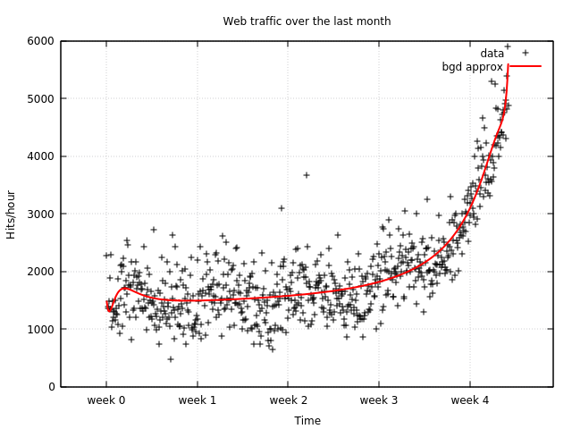

# Polynomial regression with Eigen library tutorial

Hello, this is my third article about how to use modern C++ for solving machine learning problems. This time I will show how to make a model for polynomial regression problem described in previous [article](https://github.com/Kolkir/mlcpp/tree/master/polynomial_regression), with well known linear algebra library called [Eigen](eigen.tuxfamily.org).

Eigen was chosen because it is widely used and has a long history, it is highly optimized for CPU, and is a header only library. One of the famous project using it is [TensorFlow](https://www.tensorflow.org/).

Please look at previous [article](https://github.com/Kolkir/mlcpp/tree/master/polynomial_regression) to learn how to download and parse training data.

1. **Loading data to Eigen data-structures**

	There are several approaches to initialize matrices in Eigen library, couple of them I used in next code sections.
	```cpp
	typedef float DType;
	using Matrix = Eigen::Matrix<DType, Eigen::Dynamic, Eigen::Dynamic>;
	...
	size_t rows = raw_data_x.size();
	const auto data_x = Eigen::Map<Matrix>(raw_data_x.data(), rows, 1);
	...
	Matrix poly_x = Matrix::Zero(rows, cols);
	...
	Matrix m(rows, cols);
	```
	Here I mapped raw C array of floats to ``Eigen::Matrix`` with ``Eigen::Map`` function, used special initialization method ``Matrix::Zero`` to define zero matrix with predefined size, and defined matrix with uninitialized values.

	 Please look at how I defined ``Matrix`` type, it uses dynamic memory management. I used such strategy because dimensions of training and evaluation data is not known at initial state. Eigen also supports static memory management strategy for matrices which has better performance.

2. **Standardization**

	To be able to perform successful computations for regression analysis we need to [standardize](https://en.wikipedia.org/wiki/Feature_scaling#Standardization) our data.
	```cpp
	auto standardize(const Matrix& v) {
	  auto m = v.colwise().mean();
	  auto n = v.rows();
	  DType sd = std::sqrt((v.rowwise() - m).array().pow(2).sum() /
	                       static_cast<DType>(n - 1));
	  Matrix sv = (v.rowwise() - m) / sd;
	  return std::make_tuple(sv, m(0, 0), sd);
	}
	...
	// standardize data
	Matrix x;
  std::tie(x, std::ignore, std::ignore) = standardize(data_x);
	// I'm not  using structured binding, because hard to debug such values
  Matrix y;
  DType ym{0};
  DType ysd{0};
  std::tie(y, ym, ysd) = standardize(data_y);
	// used later for scale restoring
	```
	The interesting moments here are :
	1.  ``mshadow::expr::broadcast`` function which make possible to define element wise operations for tensors with single value, for example subtraction one number from each tensor element. There is a dynamic broadcasting in this library, but to use it you need actual value (it doesn't work for expressions), so in some cases it requires earlier expression evaluation which can hurt performance.
	2.  ``mshadow::expr::sumall_except_dim`` function which calculate sum of elements along not specified tensor dimension.
	3.  ``mshadow::expr::F`` custom user specified operation on tensor elements, I used power and square root operations:
	```cpp
	struct Pow {
	  MSHADOW_XINLINE static float Map(float x, float y) { return pow(x, y);}
	};

	struct Sqrt {
	  MSHADOW_XINLINE static float Map(float x) { return sqrt(x); }
	};
	```

3. **Generating additional polynomial components**

	Before generating actual polynomial components, we need to scale our data to an appropriate range before raising to a power to prevent ``float`` type overflow in the optimizer.  A scale factor was chosen after several experiments with polynomial degree of 64.
	```cpp
	DType scale = 0.6;
	x *= scale;
	y *= scale;
	```
	Here you can see the example of a dynamic broadcasting. To make additional polynomial components I just raise to power from ``1`` no ``n`` each sample from ``X`` data set (where ``n`` is a polynomial degree):
	```cpp
	template <typename Device, typename DType>
	void generate_polynomial(mshadow::Tensor<Device, 2, DType> const& tensor,
	                         mshadow::TensorContainer<Device, 2, DType>& poly,
	                         size_t p_degree) {
	  ...
	  auto rows = tensor.shape_[0];
	  mshadow::TensorContainer<Device, 2, DType> col_temp(mshadow::Shape2(rows, 1));
	  col_temp.set_stream(tensor.stream_);

	  for (size_t c = 0; c < p_degree; ++c) {
	    auto col = mshadow::expr::slice(poly, mshadow::Shape2(0, c),
	                                    mshadow::Shape2(rows, c + 1));
	    col_temp = mshadow::expr::F<Pow>(tensor, static_cast<DType>(c));
	    col = col_temp;
	  }
	}
	...
	size_t p_degree = 64;
	mshadow::TensorContainer<xpu, 2, DType> poly_x(mshadow::Shape2(rows, p_degree));
	poly_x.set_stream(computeStream.get());
	generate_polynomial(x, poly_x, p_degree);
	```
	The most interesting thing here is function ``mshadow::expr::slice`` which produce a references slice from original tensor and you can use it as separate tensor object in expressions. I didn't make function ``generate_polinomial`` return a ``TensorContainer`` object, because there is a missing of explicit ``Tensor`` object initialization in its copy constructor which leads to compiler warnings.

4. **Generating new data for testing model predictions**

	Generating new data is very straight forward, I generate contiguous values from ``min`` value to ``max`` value of original ``X`` data set, with constant step, which is defined by total number of values.  The new data are also standardized and scaled, and additional polynomial components are generated.
	```cpp
	size_t n = 2000;
	auto minmax_x = std::minmax_element(raw_data_x.begin(), raw_data_x.end());
	auto time_range = *minmax_x.second - *minmax_x.first;
	auto inc_step = time_range / n;
	auto x_val = inc_step;
	std::vector<DType> new_data_x(n);
	for (auto& x : new_data_x) {
	  x = x_val;
	  x_val += inc_step;
	}
	mshadow::TensorContainer<xpu, 2, DType> new_x(mshadow::Shape2(n, 1));
	new_x.set_stream(computeStream.get());
	load_data<xpu>(new_data_x, new_x);
	standardizer.transform(new_x);
	new_x *= scale;

	mshadow::TensorContainer<xpu, 2, DType> new_poly_x(
	    mshadow::Shape2(n, p_degree));
	new_poly_x.set_stream(computeStream.get());
	generate_polynomial(new_x, new_poly_x, p_degree);
	```

5. **Batch gradient descent implementation**

	For this example code for learning model and results predicting I moved to separate class. It helps to reuse code more easily and make its usage more clear. Also here I implemented  [AdaDelta](https://arxiv.org/abs/1212.5701) optimizing technique, because it makes learning process to converge quicker and  dynamically adapts learning rate during training. You should pay attention on next things:
		1. using ``mshadow::expr::dot`` function for tensors(matrix) multiplication
		2. using ``Slice`` function for batches extracting
		3. usung ``T()`` method of tensor object for taking a transposed one.

	```cpp
	template <typename Device, typename DType>
	class Optimizer {
	 public:

	  void predict(mshadow::Tensor<Device, 2, DType> const& x,
	               mshadow::Tensor<Device, 2, DType>& y) {
	    y = mshadow::expr::dot(x, weights);
	  }

	  void fit(mshadow::Tensor<Device, 2, DType> const& x,
	           mshadow::Tensor<Device, 2, DType> const& y) {
	    size_t cols = x.shape_[1];
	    size_t rows = x.shape_[0];
	    size_t n_batches = rows / batch_size;
	    ...
	    for (size_t epoch = 0; epoch < n_epochs; ++epoch) {
	      for (size_t bi = 0; bi < n_batches; ++bi) {
	        auto bs = bi * batch_size;
	        auto be = bs + batch_size;
	        auto batch_x = x.Slice(bs, be);
	        auto batch_y = y.Slice(bs, be);

	        predict(batch_x, yhat);

	        error = yhat - batch_y;
	        grad = mshadow::expr::dot(batch_x.T(), error);
	        grad /= batch_size;

	        // AdaDelta
	        eg_sum = lr * eg_sum + (1.f - lr) * mshadow::expr::F<Pow>(grad, 2);
	        weights_delta = -1.f *
	                        (mshadow::expr::F<Sqrt>(ex_sum + e) /
	                         mshadow::expr::F<Sqrt>(eg_sum + e)) *
	                        grad;
	        ex_sum =
	            lr * ex_sum + (1.f - lr) * mshadow::expr::F<Pow>(weights_delta, 2);
	        weights = weights + weights_delta;
	      }
	      ...
	    }
	  }
	...
	};
	```
	``predict`` method doesn't return a value and takes an output parameter to prevent compiler warnings.

6. **Training the regression model**

	With class defined above I can run training pretty easily:
	```cpp
	Optimizer<xpu, DType> optimizer;
	optimizer.fit(poly_x, y);
	```

7. **Making predictions**

	Predictions also are straight forward:
	```cpp
	mshadow::TensorContainer<xpu, 2, DType> new_y(mshadow::Shape2(n, 1));
	new_y.set_stream(computeStream.get());
	optimizer.predict(new_poly_x, new_y);
	```
	But before actual using of predicted values we need to restore scaling and undo standardization (our model learned to return such types of values):
	```cpp
	new_y /= scale;
	new_y = (new_y * y_moments[1]) + y_moments[0];
	```
	Here ``y_moments[1]`` is a standard deviation and ``y_moments[0]`` is a mean.

9. **Plot results**

	To plot results I moved  predicted values to C++ vector data structure to have iterators compatible with a plotting library:
	```cpp
	std::vector<DType> raw_pred_y(n);
	mshadow::Tensor<mshadow::cpu, 2, DType> pred_y(raw_pred_y.data(),mshadow::Shape2(n, 1));
	mshadow::Copy(pred_y, new_y, computeStream.get());
	...
	plotcpp::Plot plt(true);
	...
	plt.Draw2D(
    plotcpp::Points(raw_data_x.begin(), raw_data_x.end(), raw_data_y.begin(),
                      "points", "lc rgb 'black' pt 1"),
    plotcpp::Lines(new_data_x.begin(), new_data_x.end(), raw_pred_y.begin(),
                     "poly line approx", "lc rgb 'green' lw 2"));
    plt.Flush();
	```
	


You can find full source of this example on [GitHub](https://github.com/Kolkir/mlcpp).
