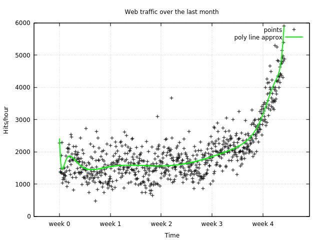

# Polynomial regression with MShadow library tutorial

Hello, this is my second article about how to use modern C++ for solving m polynomial regression to make a model to predict an amount of traffic passed through the system at some time point. Our prediction will be based on data gathered over some time period. The ``X`` data values correspond to time points and ``Y`` data values correspond to time points.

For this tutorial I chose [XTensor](https://github.com/QuantStack/xtensor) library, you can find documentation for it [here](https://xtensor.readthedocs.io/en/latest). This library was chosen because of its API, which is made similar to ``numpy`` as much as possible. There are a lot of other linear algebra libraries for C++ like ``Eigen`` or ``VieanCL`` but this one allows you to convert ``numpy`` samples to C++ with a minimum effort.

0. **Short polynomial regression definition**
   [Polynomial regression](https://en.wikipedia.org/wiki/Polynomial_regression) is a form of linear regression in which the relationship between the independent variable _x_ and the dependent variable _y_ is modeled as an _n_-th degree polynomial in _x_.

   

    Because our training data consist of multiple samples we  can rewrite this relation in matrix form:

    

   Where

   

   and _k_ is a number of samples if the training data.
   So the goal is to estimate the parameters vector . In this tutorial I will use gradient descent for this task. First let's define a cost function:

   

   Where _Y_ is vector of values from our training data. Next we should take a partial derivatives with respect to each  term of polynomial:

   
   
   Or in the matrix form:
   
   

   And use these derivatives to update vector  on each learning step:

   

   Where _l_ is a learning rate.
2. **Downloading data**

   I used STL ``filesystem`` library to check downloaded file existence to prevent multiple downloads, and used `libcurl` library for downloading data files, see ``utils::DownloadFile`` function implementation for details. And I used a data from "Building Machine Learning Systems with Python" book by Willi Richert.
    ``` cpp
    ...
    namespace fs = std::experimental::filesystem;
    ...
    const std::string data_path{"web_traffic.tsv"};
    if (!fs::exists(data_path)) {
      const std::string data_url{
          R"(https://raw.githubusercontent.com/luispedro/BuildingMachineLearningSystemsWithPython/master/ch01/data/web_traffic.tsv)"};
      if (!utils::DownloadFile(data_url, data_path)) {
        std::cerr << "Unable to download the file " << data_url << std::endl;
        return 1;
      }
    }
    ```
3. **Parsing data**

    For reading TSV formated data I used [fast-cpp-csv-parser](https://github.com/ben-strasser/fast-cpp-csv-parser) library. But changed default configuration of ``io::CSVReader`` object to use tabs as delimiters instead of commas. To parse whole data file I read the file line by line, see ``CSVReader::read_row`` method. Also pay attention on how I handle parse exceptions to ignore bad formatted items - just skip them.
    ``` cpp
    io::CSVReader<2, io::trim_chars<' '>, io::no_quote_escape<'\t'>> data_tsv(
      data_path);

    std::vector<DType> raw_data_x;
    std::vector<DType> raw_data_y;

    bool done = false;
    do {
      try {
        DType x = 0, y = 0;
        done = !data_tsv.read_row(x, y);
        if (!done) {
          raw_data_x.push_back(x);
          raw_data_y.push_back(y);
        }
      } catch (const io::error::no_digit& err) {
        // ignore bad formated samples
        std::cout << err.what() << std::endl;
      }
    } while (!done);
    ```
4. **Shuffling data**

    Using STL ``shuffle`` algorithm helps me to shuffle the data.
    ``` cpp
    size_t seed = 3465467546;
    std::shuffle(raw_data_x.begin(), raw_data_x.end(),
                 std::default_random_engine(seed));
    std::shuffle(raw_data_y.begin(), raw_data_y.end(),
                 std::default_random_engine(seed));
    ```
5. **Loading data to XTensor datastructures**

    I used ``xt::adapt`` function to create wrappers around existent data located in ``std::vector`` to prevent data duplicates.
    ``` cpp
     size_t rows = raw_data_x.size();
     auto shape_x = std::vector<size_t>{rows};
     auto data_x = xt::adapt(raw_data_x, shape_x);

     auto shape_y = std::vector<size_t>{rows};
     auto data_y = xt::adapt(raw_data_y, shape_y);
    ```
6. **Standardization**

    To be able to perform  successful computations for regression analysis we need to [standardize](https://en.wikipedia.org/wiki/Feature_scaling#Standardization) our data.
    ``` cpp
    ...
    typedef float DType;
    // linalg package doesn't support dynamic layouts
    using Matrix = xt::xarray<DType, xt::layout_type::row_major>;
    ...
   auto standardize(const Matrix& v) {
     assert(v.shape().size() == 1);
     auto m = xt::eval(xt::mean(v))[0];
     auto n = v.shape()[0];
     auto sd = xt::eval(
     xt::sqrt(xt::sum(xt::pow(v - m, 2)) / static_cast<DType>(n - 1)))[0];
     auto sv = (v - m) / sd;
     return std::make_tuple(xt::eval(sv), m, sd);
   }
   ```
7. **Generating new data for testing model predictions**

    Here I used ``xt::eval`` function to evaluate XTensor expression in place to get calculation results, because they required for use in ``xt::linspace`` function. ``xt::linspace`` function have same semantic as in ``numpy``.
    ``` cpp
    auto minmax = xt::eval(xt::minmax(data_x));
    Matrix new_x =
      xt::linspace<DType>(minmax[0][0], minmax[0][1], 2000);
    ```
8. **Batch gradient descent implementation**

    This is straightforward batch gradient implementation. The interesting things here is how I used ``xt::view`` to extract batches without real copying the data, key features are using ``xt::range`` and ``xt::all`` functions to define slice ranges for required dimensions.
    ``` cpp
    auto bgd(const Matrix& x, const Matrix& y, size_t batch_size) {
	  size_t n_epochs = 50000;
	  DType lr = 0.0055;

	  auto rows = x.shape()[0];
	  auto cols = x.shape()[1];

	  size_t batches = rows / batch_size;  // some samples will be skipped
	  Matrix b = xt::zeros<DType>({cols});

	  DType prev_cost = std::numeric_limits<DType>::max();
	  for (size_t i = 0; i < n_epochs; ++i) {
	    for (size_t bi = 0; bi < batches; ++bi) {
	      auto s = bi * batch_size;
	      auto e = s + batch_size;
	      Matrix batch_x = xt::view(x, xt::range(s, e), xt::all());
	      Matrix batch_y = xt::view(y, xt::range(s, e), xt::all());

	      auto yhat = xt::linalg::dot(batch_x, b);
	      Matrix error = yhat - batch_y;

	      auto grad = xt::linalg::dot(xt::transpose(batch_x), error) /
	                  static_cast<DType>(batch_size);

	      b = b - lr * grad;
	    }

	    auto cost = (xt::sum(xt::pow(y - xt::linalg::dot(x, b), 2.f)) /
	                 static_cast<DType>(rows))(0);  // evaluate value immediatly

	    std::cout << "Iteration : " << i << " Cost = " << cost << std::endl;
	    if (cost <= prev_cost)
	      prev_cost = cost;
	    else
	      break;  // early stopping
	  }
	  return b;
	}
    ```
9. **Generating additional polynomial components**

    To be able to approximate our data with higher degree polynomial I wrote a function for generating additional terms. Pay attention at ``x^0`` term which is used to simplify math calculations and use power of vectorization, it correcponds to ``b0`` and equals 1.  So this function returns new matrix for ``X`` data with next terms for each row ``Xi = [1, xi, xi^2, xi^3, ..., xi^n]`` where ``i`` is row index.  Also each column is standardized.
    ``` cpp
	auto generate_polynomial(const Matrix& x, size_t degree) {
	  assert(x.shape().size() == 1);
	  auto rows = x.shape()[0];
	  auto poly_shape = std::vector<size_t>{rows, degree};
	  Matrix poly_x = xt::zeros<DType>(poly_shape);
	  // fill additional column for simpler vectorization
	  {
	    auto xv = xt::view(poly_x, xt::all(), 0);
	    xv = xt::ones<DType>({rows});
	  }
	  // copy initial data
	  {
	    auto xv = xt::view(poly_x, xt::all(), 1);
	    xv = std::get<0>(standardize(x));
	  }
	  // generate additional terms
	  auto x_col = xt::view(poly_x, xt::all(), 1);
	  for (size_t i = 2; i < degree; ++i) {
	    auto xv = xt::view(poly_x, xt::all(), i);
	    xv = xt::pow(x_col, static_cast<DType>(i));
	    xv = std::get<0>(standardize(xv));
	  }
	  return poly_x;
	}
    ```
10. **Creating general regression model**

    To be able to test different models which correspond to different polynomial order I made a function which perform data scaling, generate additional polynomial terms, learn polynomial coefficients with BGD and returns function which takes new data for X and return predicted Y values. The most interesting thing here is restoration of scale for predicted Y values.
    ``` cpp
	auto make_regression_model(const Matrix& data_x,
	                           const Matrix& data_y,
	                           size_t p_degree,
	                           bool equation) {
	  // Y standardization                  
	  auto [y, ym, ysd] = standardize(data_y);

	  // X standardization & polynomization
	  Matrix x = xt::eval(generate_polynomial(data_x, p_degree));

	  Matrix b;
	  if (equation) {
	    // calculate parameters witn normal equation
	    auto xt = xt::transpose(x);
	    b = xt::linalg::dot(
	        xt::linalg::dot(xt::linalg::inv(xt::linalg::dot(xt, x)), xt), y);
	    auto cost = (xt::sum(xt::pow(y - xt::linalg::dot(x, b), 2.f)) /
	                 static_cast<DType>(x.shape()[0]))[0];
	    std::cout << "calculated cost : " << cost << std::endl;
	  } else {
	    // learn parameters with Gradient Descent
	    b = bgd(x, y, 15);
	  }

	  // create model
	  auto model = [b, ym, ysd, p_degree](const auto& data_x) {
	    auto x = xt::eval(generate_polynomial(data_x, p_degree));
	    Matrix yhat = xt::linalg::dot(x, b);
	    // restore scaling for predicted line values

	    yhat = (yhat * ysd) + ym;
	    return yhat;
	  };
	  return model;
	}
    ```
11. **Making predictions**

    Here are examples how function for creating different regression models can be used and how  to make a predictions.
    ``` cpp
    // straight line
    auto line_model = make_regression_model(data_x, data_y, 2, false);
    Matrix line_values = line_model(new_x);

    // poly line
    auto poly_model = make_regression_model(data_x, data_y, 16, false);
    Matrix poly_line_values = poly_model(new_x);
    ```
12. **Plot results**

    To plot data I used [plotcpp](https://github.com/Kolkir/plotcpp) library which is thin wrapper for ``gnuplot`` application. This library use iterators for access to plotting data so I needed to adapt ``XTensor`` matrices to objects which can provide STL compatible iterators, ``xt::view`` function returns such objects.
    ``` cpp
    auto x_coord = xt::view(new_x, xt::all());
    auto line = xt::view(line_values, xt::all());
    auto polyline = xt::view(poly_line_values, xt::all());
    ```
    Next I created plot object, configured it and plotted the data and approximation results.
    ``` cpp
    plotcpp::Plot plt(true);
    plt.SetTerminal("qt"); // show ui window with plots
    plt.SetTitle("Web traffic over the last month");
    plt.SetXLabel("Time");
    plt.SetYLabel("Hits/hour");
    plt.SetAutoscale();
    plt.GnuplotCommand("set grid"); // show coordinate grid under plots

    // change X axis values interval
    auto time_range = minmax[0][1] - minmax[0][0];
    auto tic_size = 7 * 24;
    auto time_tics = time_range / tic_size;
    plt.SetXRange(-tic_size / 2, minmax[0][1] + tic_size / 2);

    // change X axis points labels to correspond to week duration
    plotcpp::Plot::Tics xtics;
    for (size_t t = 0; t < time_tics; ++t) {
      xtics.push_back({"week " + std::to_string(t), t * tic_size});
    }
    plt.SetXTics(xtics);

    plt.Draw2D(plotcpp::Points(data_x.begin(), data_x.end(), data_y.begin(),
                               "points", "lc rgb 'black' pt 1"),
               plotcpp::Lines(x_coord.begin(), x_coord.end(), line.begin(),
                              "line approx", "lc rgb 'red' lw 2"),
               plotcpp::Lines(x_coord.begin(), x_coord.end(), polyline.begin(),
                              "poly line approx", "lc rgb 'green' lw 2"));
    plt.Flush();
    ```
    With this code we get such plots:
    

You can find full source of this example on [GitHub](https://github.com/Kolkir/mlcpp).

Next time I will solve this task with [MShadow](https://github.com/dmlc/mshadow) library to expose power of a GPU.
<!--stackedit_data:
eyJoaXN0b3J5IjpbNjkzNTk4MTc2LC0xNDQ1MjY2MDc0LDExNT
QyNzExMzgsNDI3MjMxOTM2XX0=
-->
<!--stackedit_data:
eyJoaXN0b3J5IjpbLTE2MTk2NDcwN119
-->